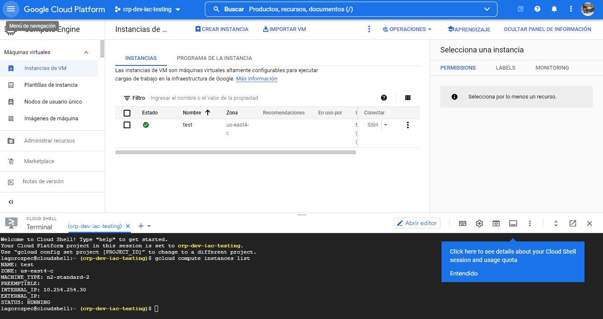
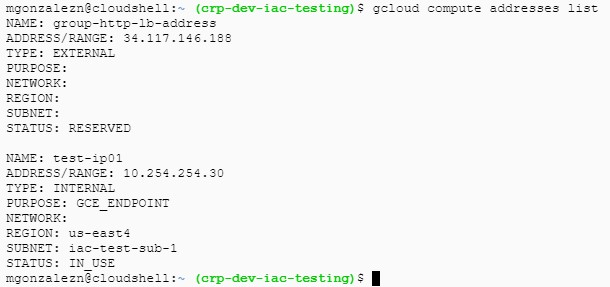
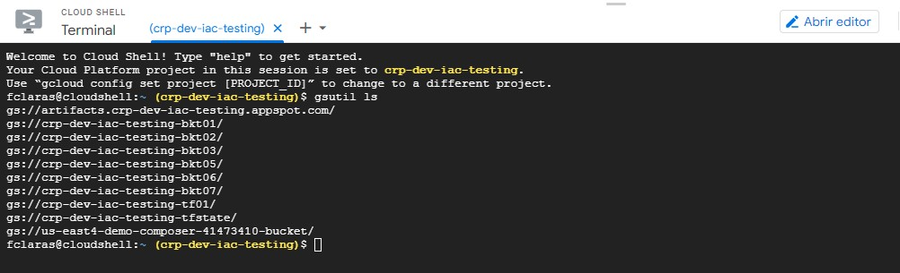
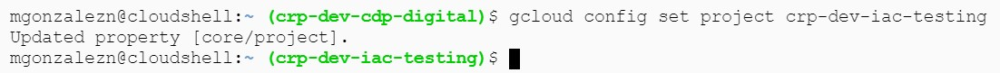
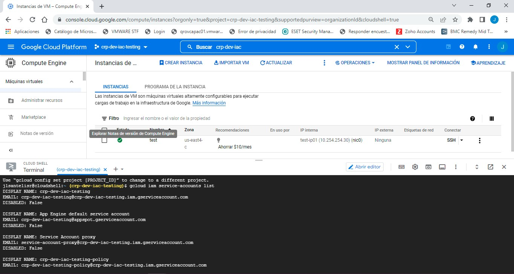

# 
 *Tarea 3 - Comandos GCP* 

## 
 " *Comando para Listar Compute Engine* " 

### Comando :arrow_down:
#### :heavy_dollar_sign: gcloud compute instances list

  

 "Consulta el enlace"

 https://cloud.google.com/sdk/gcloud/reference/compute/instances/list  

## 
 " *Listar IP’s en uso, existentes o reservadas*" 

### Comando :arrow_down:
#### :heavy_dollar_sign: gcloud compute addresses list

  

 "Consulta el enlace"

 https://cloud.google.com/sdk/gcloud/reference/compute/addresses/list 

## 
 " *Listar buckets disponibles* " 

### Comando :arrow_down:
#### "*gcloud*" :heavy_dollar_sign: gcloud alpha storage ls
#### "*gsutil*" :heavy_dollar_sign: gsutil ls

  

 "Consulta el enlace"

 https://cloud.google.com/storage/docs/listing-buckets#gcloud-list-buckets 

## 
 " *Ingresar a X proyecto*" 

### Comando :arrow_down:
#### :heavy_dollar_sign: gcloud config set project +PROYECTO
#### *gcloud config set proyect crp-dev-iac-testing*

  

 "Consulta el enlace"

 https://cloud.google.com/sdk/gcloud/reference/config/set 

## 
 " *Listar Service Accounts existentes en un proyecto*" 

### Comando :arrow_down:
#### :heavy_dollar_sign: gcloud iam service-accounts list

  

 "Consulta el enlace"

 https://pnatraj.medium.com/how-to-run-gcloud-command-line-using-a-service-account-f39043d515b9 

